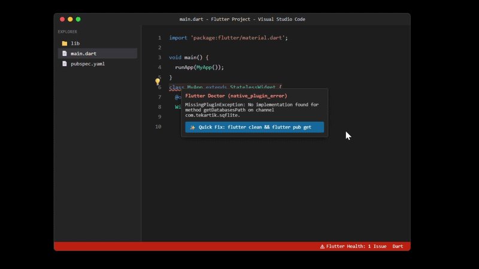

<div align="center">
  
  
  # Flutter Doctor Plus 

  **The Ultimate Developer Intelligence Platform for Flutter**

  [](./LICENSE)
  [](https://marketplace.visualstudio.com/manage/publishers/crealify)
  []()
</div>

---

## 📖 Overview

Welcome to the open-source repository for **Flutter Doctor Plus**. 

Flutter Doctor Plus is a premium VS Code extension built to eliminate the frustration of cryptic Flutter build failures. Whether you are dealing with obscure Gradle build exceptions, tricky pubspec version conflicts, or complex Null Safety violations, this extension instantly identifies the root cause and provides a one-click automated fix directly inside your editor.

## 📸 In Action

See the intelligence engine catch a missing native plugin exception and offer a real-time, automated Quick Fix:



> **Try the Interactive UI Mockup:** [Click here to see the interactive HTML preview](https://htmlpreview.github.io/?https://github.com/Crealify/flutter_doctor_plus/blob/main/apps/vscode-extension/demo-mockup.html)

---

## ✨ Core Features

* **Deterministic Intelligence Engine**: Recognizes over 50+ common Flutter/Dart build errors locally using lightning-fast regex pattern matching. Zero hallucinations.
* **AI-Powered Fallback**: If an error is highly specific to your environment, the rule engine falls back to a secure, opt-in AI-assisted analysis using OpenAI to generate a structured fix command.
* **Custom Team Rules**: Define your own custom error-matching rules directly in your `settings.json` to automate fixes for proprietary company architecture.
* **Interactive Health Monitor**: A dedicated VS Code Status Bar item provides real-time feedback on your project's stability.
* **Editor Mapping**: Uses the VS Code Diagnostics API to map terminal errors back to the exact file and line number, underlining the problem in red.

---

## 🏗 Monorepo Architecture

This project is structured as an enterprise-grade **NPM Workspace Monorepo** to ensure maximum modularity, testability, and separation of concerns.

```text
flutter_doctor_plus/
├── apps/
│   └── vscode-extension/      # The actual VS Code Extension host application.
│                              # Handles UI, Status Bar, CodeActions, and VS Code APIs.
│
├── packages/
│   ├── core/                  # The deterministic Intelligence Engine.
│   │                          # Contains the `LogAnalyzer`, error mapping logic, and AI Fallback clients.
│   │
│   └── rules/                 # The Error Signature Database.
│                              # A centralized, updateable dictionary of regex patterns, 
│                              # error fingerprints, and their associated terminal fix commands.
```

### Why a Monorepo?
By abstracting the core logic (`@flutter-doctor/core`) and the error database (`@flutter-doctor/rules`) away from the VS Code specific UI (`apps/vscode-extension`), we ensure that the intelligence engine can easily be ported to other platforms in the future (such as a CLI tool, IntelliJ plugin, or CI/CD pipeline integration) without rewriting any logic.

---

## 🚀 Local Development & Contribution

If you want to clone this repository, build the extension from source, or contribute to the project, follow these steps:

### Prerequisites
*   [Node.js](https://nodejs.org/) (v16 or higher)
*   [VS Code](https://code.visualstudio.com/)

### 1. Install Dependencies
Because this is an NPM Workspace, running `npm install` at the root will automatically link the internal packages together.
```bash
git clone https://github.com/Crealify/flutter_doctor_plus.git
cd flutter_doctor_plus
npm install
```

### 2. Build the Extension
The VS Code extension uses `esbuild` to securely bundle the monorepo packages into a single, highly optimized runtime file.
```bash
cd apps/vscode-extension
npm run package
```
*(This will generate a `dist/extension.js` file and a `.vsix` package).*

### 3. Debugging in VS Code
To run the extension locally in a testing environment:
1. Open the project root in VS Code.
2. Press `F5` to start debugging. A new "Extension Development Host" window will open with the extension loaded.

---

## 📚 End-User Documentation

If you are just looking to use the extension, configure the AI API keys, or add custom rules, please read the [Official Extension User Guide](./apps/vscode-extension/README.md).

---

## 🔒 Security & Privacy

*   **100% Local Execution**: The standard intelligence engine runs entirely locally. Your terminal logs and source code are never transmitted externally.
*   **Opt-In AI Fallback**: The OpenAI fallback is strictly opt-in and requires you to provide your own API key. Only the specific lines containing the error (max 20 lines) are sent to OpenAI to preserve your token limits and ensure proprietary source code is not leaked.

---

## 📝 License

Distributed under the MIT License. See [`LICENSE`](./LICENSE) for more information.

---
<div align="center">
  Built with ❤️ by <b>Crealify</b> for the Flutter & Dart community.
</div>
